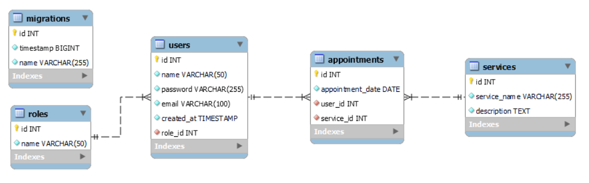
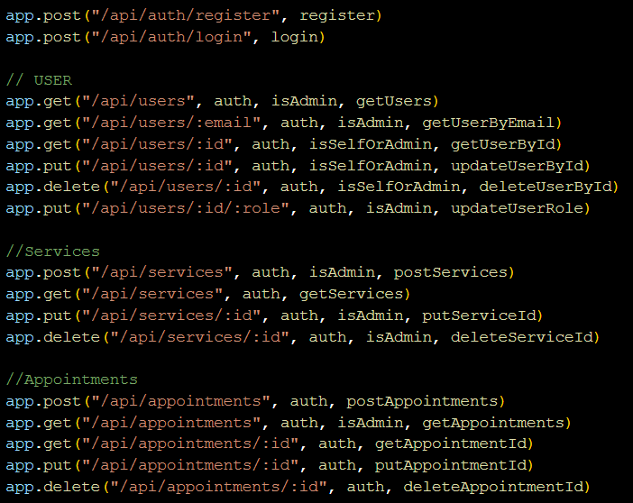

# Appointment Website Backend 

¡Welcome all to my appointment website backend reporsitory! This the fourth project at GeeksHubs Academy, consisting in the back and database code of an appointment site, in this case a tatto shop.




## 🛠️ Tech&Tolls used 


## 🚀 Installation and usage

<ol>
 <details>
 To be able to have the container to properly run the database localy you shall need to have docker.
  <summary style="padding-left:1px; font-weight:bolder">1. INSTALL DOCKER</summary>
 
  <ol>
   <li> Install docker and run this command to get a container</li>

`$ docker run --name mysql-appointments -p 3307:3306 -e MYSQL_ROOT_PASSWORD=1234 -d mysql`

<li>Run it</li>

`$ mysql -h localhost -P 3306 -u root -p you will need -h (host), -P (port), -u(username) and -p (password)`

`$ docker exec -it mysql-appointments bash`

   </ol>
</details>
<!-- End previously item -->

<details>
<summary style="font-weight:bolder" >2. INSTALL EXPRESS

</summary>
<ol>

`$ npm init `

<li>Run follow command to create "package-lock.json" install node_modules</li>

`$ npm install express --save`

<li>
  Create .gitignore in root and add "./node_modules" , ".env" and ".dist" to
  avoid upload to github repository
</li>


`$ npm install typescript -D`

<li>Create the 'tsconfig.json' file</li>

`$ npm tsc --init`

<li>Install types/express & node</li>

`$ npm install @types/express @types/node -D`

<li>Install dependencies to compile TS (nodemon)</li>

` $ npm install ts-node nodemon -D`

<li>Add a shorcut to the package.json's scripts:</li>

`"dev": "nodemon ./src/server.ts"`

<li>
  Create ".env" and ".env.example" file The .env file has the key & value
  credentials to access to the data base. It should not be visible, for this
  reason we add it to .gitingnore. The ".env.example" files have the same
  structure to build your ".env" file on your local
</li>
<br />
<li>
  Install 'dotenv' to added th depencencies and will grab data from the .env
  file
</li>

` $ npm install dotenv`

<li>
  DOTENV - Create the folder "src" with "server.ts" file inside. This the code
  to connect to the server.
</li>

```js
import "dotenv/config" import { app } from"./app"
import { AppDataSource } from "./database/db"

  // sets up the connection
port const PORT = process.env.PORT || 4500

const startServer = () => {

AppDataSource.initialize() .then(() => {
   console.log("Database Appointment API connected")

app.listen(PORT, () => {
  console.log(`Server is running at PORT:${PORT}`)

    })
 }).catch((error) => {
       console.log(error)
  })
  }

 startServer()
```

<!-- End previously item -->
<li>We create app.ts file</li>

```js
// links to .env file
import "dotenv/config"
import express, { Application } from "express"
// export app function export
const app: Application = express()
// parses response to .json
app.use(express.json())
// testing request
app.get("/healthy", (req, res) => {
  res.status(200).json({
    success: true,
    message: "Server is healthy",
  })
})
```

<!-- End previously item -->

</ol>
<!-- End previously item -->
</details>
<!-- End previously item -->

<details>
<summary style="font-weight:bolder" >3. CREATE MYSQL
</summary>

<ol>
<li>Think and rethink the database, avoid redundancy between keys and related tables. Identify primary keys (PK) and foreign keys (FK). Choose the type of value, if it is 'NULL' (not required) or can be 'UNIQUE' fields.</li>
 <li>Open Mysql Workbench and set up new dataBase connection
</li>

 <li>Click on plus icon and put in the field "Connection Name" the data base name.
 Add the port 3309 like we was defined when we start the docker container. Then you can test connection to check if it's all right.
 </li>

 <li>The next step is create a new schemma. Press right button mouse and choose "Create Schemma"</li>


 <li>Write in the field the new schemma name. "appointmentApi" and press apply </li>

<li>Run the previusly shorcut created to connect to the server.</li>
 </ol>
</details>
<!-- End previously item -->
<details>
  <summary style="font-weight:bolder" >4. MIGRATIONS & MODELS</summary>

- Creating MIGRATIONS [Data Definition Language (DDL): with typeorm]:
  `$ npm run run-migrations`
  `./src/database/migrations`

- Adding them to `DataSource.migrations` in the `db.ts` file: `Role, User, Service, Appointment`
  

- Adding them to `DataSource.entities` in the `db.ts` file: `Roles, Users, Services, Appointments`

</details>

<details>
  <summary style="font-weight:bolder" >5. CONTROLLERS</summary>

- We create controllers (in a folder on the same level with `package.json`): > `auth, roles, users, services, appointments`

</details>

<details>
  <summary style="font-weight:bolder" >6. ROUTES</summary>

- We create routes (in `app.ts`) for CRUD (create, read, update and delete) database records.


</details>

<details>
  <summary style="font-weight:bolder" >7. MIDDLEWARE: AUTHENTICATOR</summary>
  
  - Additionally we need to control access to our data. We will use 'middleware' functions.

- Auth`(authorization system based on TOKENs) will block anything that should not be seen by the general public. In our case, it only does not affect`register`, `login`and`getServices` (since those are the endpoints accessible without logging in).
- The `auth()` function verifies an encrypted TOKEN created automatically at login. With an active token we have access to other data.


- We also want to grant special administrative access. With another middleware, the `isSuperAdmin()` function, we control PERMISSIONS.
- The 'superadmin' role would be able to reach all data, while Users would have a more limited reach. More levels can be implemented. By default the seeder creates 3 role levels: user[1], admin[2], and superadmin[3]
</details>

<details>
  <summary style="font-weight:bolder" >9. TOKENDATA</summary>

- For the TOKEN to work, we create a new file `./types/index.d.ts` with the following lines:

      ```js
      export type tokenData = {
          userId: number;
          roleName: string;
      };

      declare global {
          namespace Express {
              export interface Request {
                  tokenData: tokenData;
              }
          }
      }
      ```

  </details>

<details>
  <summary style="font-weight:bolder" >10. SEEDERS</summary>

- To set default values to the database just run:

`$ npm run seed`

</details>

<details>
  <summary style="font-weight:bolder" >11. RUN PROJECT</summary>
  <ol>

`$ npm run dev`

  </ol>
</details>

<!-- ## Deployment -->

<!-- The project is deplyed here: -->

<!-- https://proyecto4-buscador-dev-jzta.1.ie-1.fl0.io/ -->

<!-- You can use this route for all the endpoints. -->
</ol>

## ✒️ Autor

- **Pol Montero** - Project Developer
  - [GitHub](https://github.com/hypoldev) 

## 🎓 Special Thanks

- To **Geekshubs Academy** for the trust, encouragement and knowledges to make me able to develop this first project.


## 📄 Add Ons - Bugs and Dreams

- Token storage is null, i'll change it to WebStorage at some point.
- I'd like to add a sample front end side for testing porpuses.
- The appointment controller should only create an appointment for self
- The appointment controller should validate for a valid appointment date

