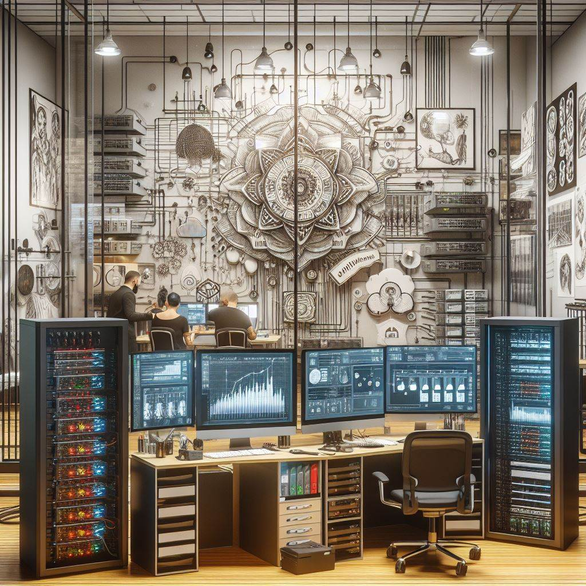

# Appointment Website Backend 

¡Welcome all to my appointment website backend reporsitory! This the fourth project at GeeksHubs Academy, consisting in the back and database code of an appointment site, in this case a tatto shop.

## 🚀 Installation and usage

Download the repository and test it with your favourite Rest Api Client, I recomend ThunderClient(VSC extension). Or you can implement the code to your own website moddifing the code. Look for app.ts to see the routes. 
Have a docker container linked to a DB (details on env.sample) shall be required.

## 🛠️ Tech&Tolls used 

## ✒️ Autor

- **Pol Montero** - Project Developer
  - [GitHub](https://github.com/hypoldev) 

## 🎓 Special Thanks

- To **Geekshubs Academy** for the trust, encouragement and knowledges to make me able to develop this first project.

## 📄 Add Ons - Bugs and Dreams

- Token storage is null, i'll change it to WebStorage at some point.
- I'd like to add a saple front end side for testing porpuses.

